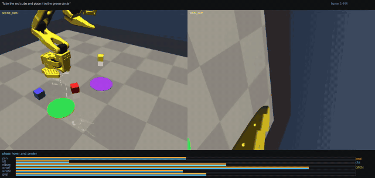
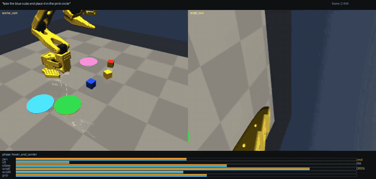

# so-101-language-action-policy

**Language-conditioned imitation-learning data generation for the LeRobot SO-101
arm in MuJoCo.**

Generates expert demonstrations for an open-ended tabletop manipulation matrix —
*"take the [COLOR] cube and place it in the [COLOR] circle"* — and emits an HDF5
dataset shaped for a language-conditioned **ACT** (Action Chunking with
Transformers) policy.

<p align="center">
  
</p>

<p align="center">
  <em>Rendered straight from the stored dataset — not a re-simulation. Left: scene
  camera. Right: wrist camera. Bottom: the live phase, and commanded (orange) vs
  observed (blue) joint positions.</em>
</p>

## Why this is not just pick-and-place

Every scene contains **2–3 differently coloured cubes and 2–3 coloured target
zones**, placed at random. The instruction is the only thing that says which cube
goes where — so a policy that ignores the language gets the right cube barely 40%
of the time by chance. Grounding has to be learned.

<p align="center">
  
</p>

<p align="center">
  <em>Same scene structure, different instruction: <code>"take the blue cube and
  place it in the pink circle"</code>. The red and yellow cubes are distractors.</em>
</p>

## Pipeline

```
seed
 └─ semantic randomization   2-3 coloured cubes + 2-3 coloured zones, random poses
 └─ language instruction     "take the red cube and place it in the green circle"
 └─ DLS-IK expert            damped least squares on MuJoCo analytical Jacobians
 └─ 7-phase quintic path     hover · approach · grasp · lift · transit · place · release
 └─ 50 Hz recording          scene cam + wrist cam + qpos + qvel + action
 └─ HDF5                     action chunks + frozen CLIP ViT-B/32 embedding
 └─ strict success validator every cube corner inside the zone, at rest
```

## Results

| Metric | Value |
| --- | --- |
| Expert success, held-out seeds 10000–10099 | **100 / 100** |
| Expert success, seeds 0–249 | **250 / 250** |
| Placement centre error | median 2.7 mm, p90 4.6 mm |
| Tests | 44 passing |
| Generated dataset | 40 episodes, 17 760 timesteps, 40/40 success, 15 distinct instructions |

Success is the directive's strict criterion: **every** base corner of the cube
inside the zone perimeter, cube resting on the table and at rest.

## Quickstart

```bash
make setup                 # uv venv on Python 3.13 + install with dev,text extras
make test                  # 44 unit and property tests
make eval                  # 100-seed expert success evaluation
make preview SEED=5        # render one episode to data/episode.mp4
make collect N=100         # generate a dataset
make verify                # health-check what was generated
```

Collecting at scale — run in resumable batches and merge, rather than one
multi-hour job:

```bash
for s in 0 200 400 600 800 1000; do
  make collect N=200 SEED=$s RES=128 OUT=data/part_$s.hdf5
done
make merge SHARDS="data/part_*.hdf5" OUT=data/train.hdf5
make verify OUT=data/train.hdf5
```

## What the robot actually does

The SO-101 is a **5-DoF** arm, so a general 6-DoF pose is unreachable. The
expert only ever commands *top-down* grasps, which is exactly the family the
arm can hit precisely (`shoulder_pan` picks the plane, three joints work in it,
`wrist_roll` spins the jaws). The usable straight-down workspace is a measured
annulus of r ∈ [0.16, 0.26] m — not the 0.478 m raw kinematic reach. See
the module docstring of `src/so101_sim/kinematics.py` and the workspace
comment in `src/so101_sim/constants.py`.

## Verifying the data

```bash
make verify                 # automated health checks on the stored dataset
make replay EP=0            # render a STORED episode with overlays
make viewer SEED=5          # interactive MuJoCo viewer (geometry inspection)
make inspect                # schema and summary
```

`replay_dataset.py` and `verify_dataset.py` read **only what is on disk** — they
never re-simulate. A policy trains on the bytes in the file, and those are what
can be silently wrong.

## Where the knowledge lives

This repo is intentionally self-documenting — there is no separate docs tree to
drift out of date.

| Question | Answer lives in |
| --- | --- |
| Why does a physical constant have this value? | Inline comments in `src/so101_sim/constants.py`, each carrying the measurement that produced it |
| What is the on-disk HDF5 schema? | Module docstring of `src/so101_sim/recorder.py` |
| How does a policy consume this data? | `scripts/act_dataloader_example.py` |
| Why top-down grasps only? | Module docstring of `src/so101_sim/kinematics.py` |
| What do the seven phases do? | `src/so101_sim/expert_policy.py` |
| Is my generated data sound? | `make verify` |

## Scope note

This repo is the **data-generation pipeline**. The directive's final section
describes modifying an ACT *training* codebase to consume `language_embedding`
as a conditioning token; no ACT model is vendored or trained here. The dataset is
shaped to make that change direct, and `scripts/act_dataloader_example.py` plus
the `recorder.py` docstring pin down exactly how the embedding is meant to
enter the CVAE encoder and transformer decoder.

## Assets

Robot model is the official `robotstudio_so101` MJCF from
[google-deepmind/mujoco_menagerie](https://github.com/google-deepmind/mujoco_menagerie),
vendored under `assets/so101/` (Apache-2.0, license retained).
